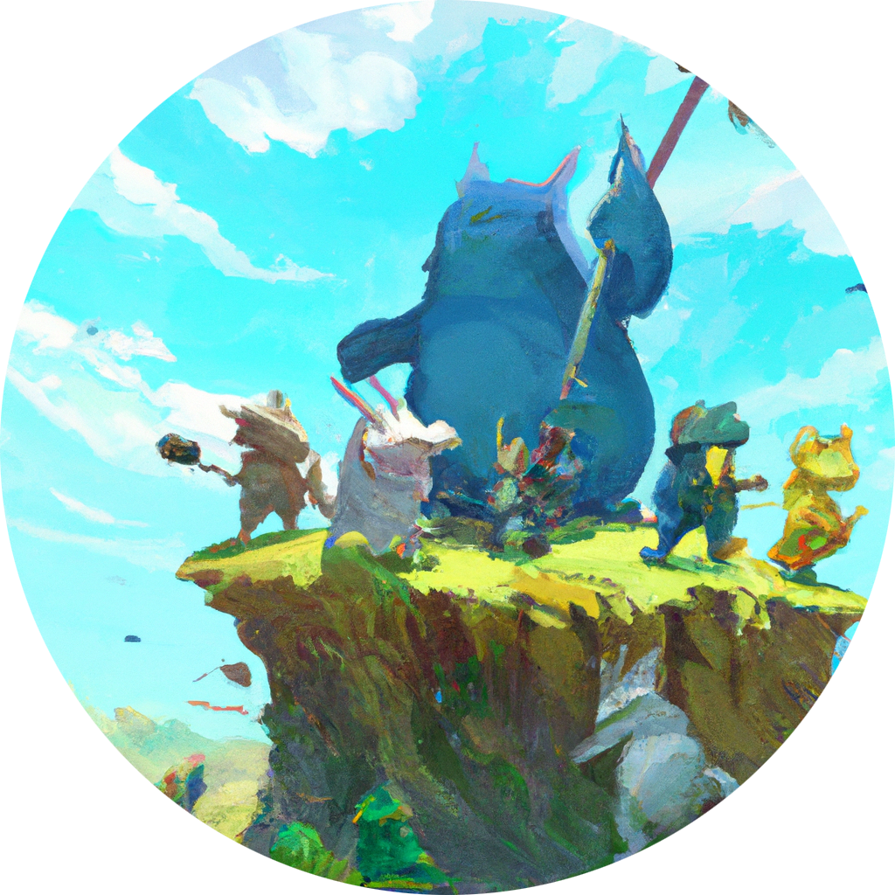

  

a re-telling of <a href="https://folktale.origamitower.com" target="_blank">folktale</a>

early stages, use at your own peril

  
  
  
  

# folklore

a re-telling of [folktale](https://folktale.origamitower.com)

in the early stages, things will change, use at your own `peril`

Currently `Maybe` and `Result` are implemented and reasonably stable. Still, minor version bumps may break things. Use
`~` in your `package.json` to avoid breaking changes.

There are some differences from Folktale's API. As an example, hasInstance is a static method on both in pascal case:
`HasInstance`. Check the source (or intellisense in your editor). See
[#13: A Retelling, not a reimplementation](https://github.com/cassiecascade/folklore/issues/13) for more information
about this.

## License

folklore is provided under the [Mozilla Public License 2.0](https://mozilla.org/MPL/2.0/).

A copy of the MPLv2 is included [license.md](/license.md) file for convenience.
